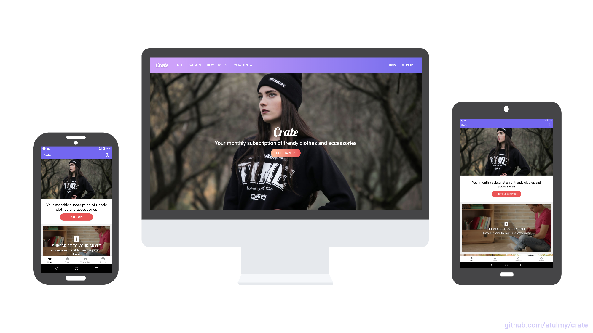

# React Crate Template 

#### Get monthly subscription of trendy clothes and accessories.
- **API** built with Node, GraphQL, Express, Sequelize (MySQL) and JWT Auth
- **WebApp** built with React and Redux along with Server Side Rendering (SSR) / SEO friendly
- **Mobile** (Android and iOS) Native App build with React Native
- Written in ES6+ using Babel + Webpack

## Features
- Modular and easily scalable code structure
- Emphasis on developer experience
- UI components in separate folder which can be swapped for your favorite UI framework easily
- Responsive UI for React Native to support Mobile and Tablet
- GraphQL schema with associations
- Database migration and data seeding
- User authentication using JSON Web Tokens with GraphQL API
- File upload feature with GraphQL
- React storybook demonstrating UI components for web
- Server side rendering
- Multi-package setup and dev scripts for an automated dev experiance

## Useful for
- Developers with basic knowledge on React exploring advance React projects
- Developers learning React Native
- Exploring GraphQL
- Scalable project structure and code
- Starter application for Mobile and Web along with SSR
- Multi-package scripts
- Sample project with combination of all above

## Screenshots and GIFs
Click on image to view fullscreen and zoom

## Core Structure
    code
      ├── package.json
      │
      ├── api (api.example.com)
      │   ├── public
      │   ├── src
      │   │   ├── config
      │   │   ├── migrations
      │   │   ├── modules
      │   │   ├── seeders
      │   │   ├── setup
      │   │   └── index.js
      │   │
      │   └── package.json
      │
      ├── mobile (Android, iOS)
      │   ├── assets
      │   ├── src
      │   │   ├── modules
      │   │   ├── setup
      │   │   ├── ui
      │   │   └── index.js
      │   │
      │   └── package.json
      │
      ├── web (example.com)
      │   ├── public
      │   ├── src
      │   │   ├── modules
      │   │   ├── setup
      │   │   ├── ui
      │   │   └── index.js
      │   ├── storybook
      │   │
      │   └── package.json
      │
      ├── .gitignore
      └── README.md

## Setup and Running
- Prerequisites
  - Node
  - MySQL (or Postgres / Sqlite / MSSQL)
- Clone repo `git clone git@github.com:atulmy/crate.git crate`
- Switch to `code` directory `cd code`
- Configurations
  - Modify `/api/src/config/database.json` for database credentials
  - Modify `/api/.env` for PORT (optional)
  - Modify `/web/.env` for PORT / API URL (optional)
  - Modify `/mobile/src/setup/config.json` for API URL (tip: use `ifconfig` to get your local IP address)
  - Add your local IP address in: `code/mobile/android/app/src/debug/res/xml/react_native_config.xml` for Cleartext Traffic (API level 28+). Read more [here](https://facebook.github.io/react-native/docs/integration-with-existing-apps#network-security-config-api-level-28).
- Setup
  - API: Install packages and database setup (migrations and seed) `cd api` and `npm run setup`
  - Webapp: Install packages `cd web` and `npm install`
  - Mobile: Install packages `cd mobile` and `npm install`
- Development
  - Run API `cd api` and `npm start`, browse GraphiQL at http://localhost:8000/
  - Run Webapp `cd web` and `npm start`, browse webapp at http://localhost:3000/
  - Run Mobile `cd mobile` and `npm start`, browse mobile on either emulator or using Expo on your mobile phone
- Production
  - Run API `cd api` and `npm run start:prod`, creates an optimized build in `build` directory and runs the server
  - Run Webapp `cd web` and `npm run start:prod`, creates an optimized build in `build` directory and runs the server

## Multi-package automation
- New developers are advised to run through the above 'setup and running' process before reading further.
- Optional multi-package automation for faster setup and easier dev environment initiation.
- No need to cd to sub-folders unless working with mobile or running a production build.
- Once Node, MySQL, repo clone and configuration are setup correctly
    - Switch to `code` directory `cd code`
    - Setup
        - Setup API, Webapp and Mobile with a single command `npm run setup`
    - Development
        - Run API and Webapp `npm start`, browse GraphiQL at http://localhost:8000/ and Webapp at http://localhost:8000/
        - Run API alone `npm start:api`, browse GraphiQL at http://localhost:8000/
        - Run Webapp alone `npm start:web`, browse webapp at http://localhost:3000/

## Why open source a project and not a boilerplate or framework?
- While building a new project with Node, you can basically start scratch, adding libraries and tools as you go on building it further.
- Comparing with any other languague, you usually start with a framework, for example, Laravel (PHP), Django (Python) or Ruby on Rails (Ruby) which includes a ton of features and codebase which you never end up using.
- I've personally found, learning by going through a good project codebase step by step while building your own project helps in ease of understanding and remembering
